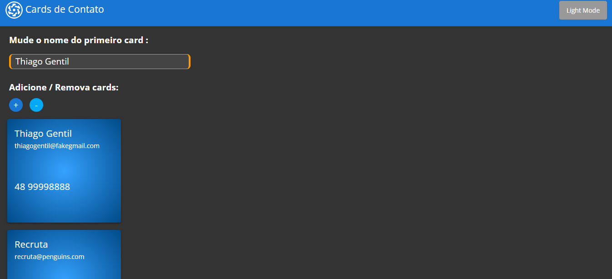

# Web Full Stack - project 1

Este é o primeiro projeto da aula do extensão do curso de Web Full Stack/Hands-on da Universidade do Sul de Santa Catarina (Unisul), ministrado pelo professor [Jean Paul Lopes](https://github.com/jeanpaullopes). O código base para o projeto pode ser encontrado em: https://github.com/jeanpaullopes/extensao23_1_aula1

## Interface




## Configuração do Ambiente

Para configurar o ambiente, siga os passos abaixo:

1.  Instale o gerenciador de pacotes [Node.js](https://nodejs.org/) que já inclui o npm, o gerenciador de pacotes padrão para o Node.js.


2. Instale o gerenciador de pacotes [yarn](https://yarnpkg.com/) com o comando:

   ```bash
   npm i -g yarn
   ```

3. Instale o framework [Quasar CLI](https://quasar.dev/start/quasar-cli) e o Vue.js com os comandos:

   ```bash
   npm install -g @quasar/cli
   npm install -g vue
   ```

   Com estes passos, você já pode prosseguir para instalar as dependências do projeto e executar os comandos descritos no restante do README.

## Instalando as dependências
```bash
yarn
# ou
npm install
```

### Iniciando a aplicação em modo de desenvolvimento (hot-code reloading, error reporting, etc.)

```bash
quasar dev
```
ou
```bash
yarn quasar dev
```
ou
```bash
npm run dev
```

Todos os comandos acima iniciam a aplicação em modo de desenvolvimento.


### Verificando os arquivos
```bash
yarn lint
# ou
npm run lint
```


### Formatando os arquivos
```bash
yarn format
# ou
npm run format
```

### Compilando a aplicação para produção
```bash
quasar build
```

### Personalizando a configuração
Veja [Configurando o quasar.config.js](https://v2.quasar.dev/quasar-cli-webpack/quasar-config-js).
